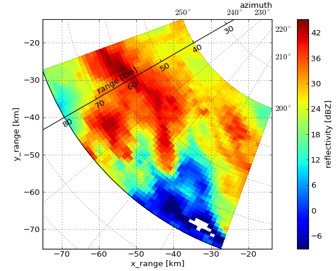

---
jupyter:
  jupytext:
    text_representation:
      extension: .md
      format_name: myst
      format_version: '1.3'
      jupytext_version: 1.17.3
---

```{raw-cell}
:tags: [hide-cell]
This notebook is part of the wradlib documentation: https://docs.wradlib.org.

Copyright (c) wradlib developers.
Distributed under the MIT License. See LICENSE.txt for more info.
```

# A one hour tour of wradlib



A guided tour of some $\omega radlib$ notebooks.

## Some background, first

Development started in 2011...or more precisely:

`October 26th, 2011`

### Key motivation

`A community platform for collaborative development of algorithms`

## Your entry points

### Start out from [wradlib.org](https://wradlib.org)

### Documentation

Check out the [online docs](https://docs.wradlib.org/) with tutorials and examples and a comprehensive [API reference](../../reference).

### Openradar discourse

Get help and connect with weather radar enthusiasts from all over the world at [openradar-discourse](https://openradar.discourse.group)!

## For developers

See our [Contributing guide](../../dev_guide).

## Installation

See [Installation](../../installation).

## To run our tutorials

1. Get [notebooks](https://github.com/wradlib/wradlib-notebooks)
2. Get [sample data](https://github.com/wradlib/wradlib-data)
3. Set environment variable `WRADLIB_DATA`

See also: [Jupyter](../../jupyter)

## Development paradigm

### Keep the magic to a minimum

- transparent
- flexible, but lower level

### Flat (or no) data model

- pass data as numpy arrays,
- and pass metadata as dictionaries.

### Labelled multi-dimensional arrays


- combine data, coordinates and attributes in flexible structures with [xarray](https://docs.xarray.dev/en/stable/) and [xradar](https://docs.openradarscience.org/projects/xradar/en/stable/)
- transparent multiprocessing using [dask](https://docs.dask.org/en/stable/)

## Import wradlib

```{code-cell} python
import wradlib
```

```{code-cell} python
# check installed version
print(wradlib.__version__)
```

In the next cell, type `wradlib.` and hit `Tab`.

*Inpect the available modules and functions.*

```{code-cell} python
```

## Reading and viewing data

### Read and quick-view
Let's see how we can [read and quick-view a radar scan](../visualisation/plot_ppi).

### Zoo of file formats
This notebook shows you how to [access various file formats](../fileio/fileio).

## Addressing observational errors and artefacts

### Attenuation

In [this example](../attenuation/attenuation), we reconstruct path-integrated attenuation from single-pol data of the German Weather Service.

### Clutter detection

wradlib provides several methods for clutter detection. [Here](../classify/fuzzy_echo), we look at an example that uses dual-pol moments and a simple fuzzy classification.

### Partial beam blockage

In [this example](../beamblockage/beamblockage), wradlib attempts to quantify terrain-induced beam blockage from a DEM.

## Integration with other geodata

### Average precipitation over your river catchment

In this example, we [compute zonal statistics](../zonalstats/zonalstats_quickstart) over polygons imported in a shapefile.

### Over and underlay of other geodata

Often, you need to [present your radar data in context with other geodata](../visualisation/gis_overlay) (DEM, rivers, gauges, catchments, ...).

## Merging with other sensors

### Adjusting radar-based rainfall estimates by rain gauges

In [this example](../multisensor/gauge_adjustment), we use synthetic radar and rain gauge observations and confront them with different adjustment techniques.
